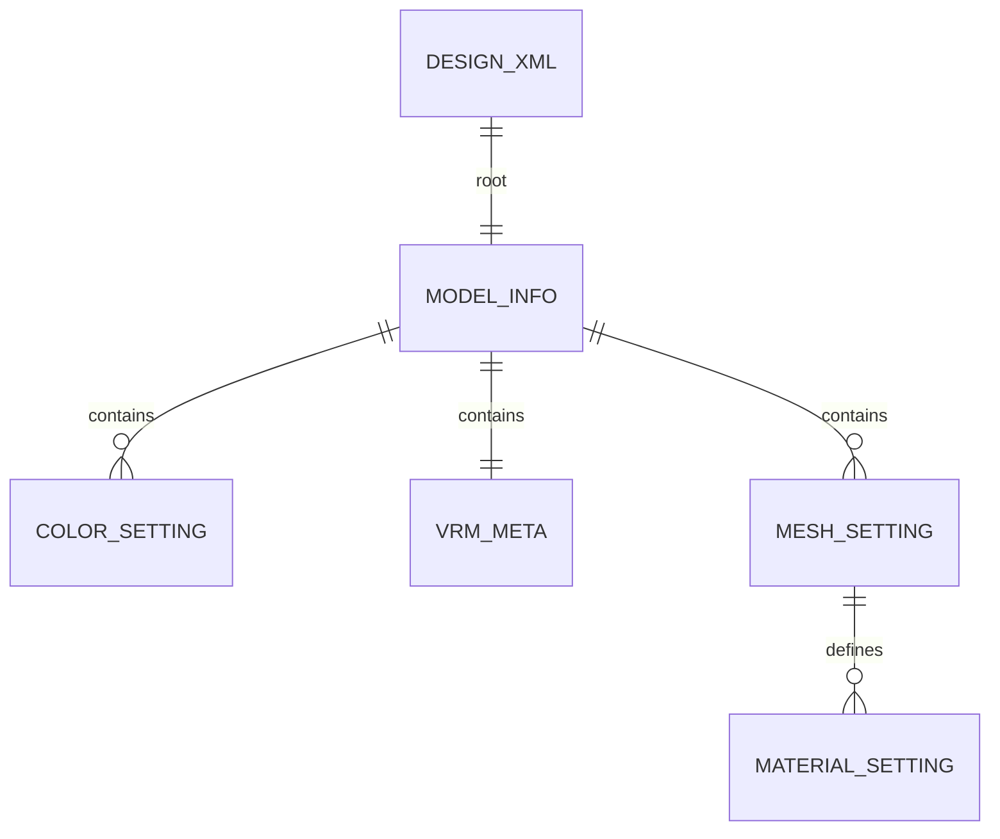
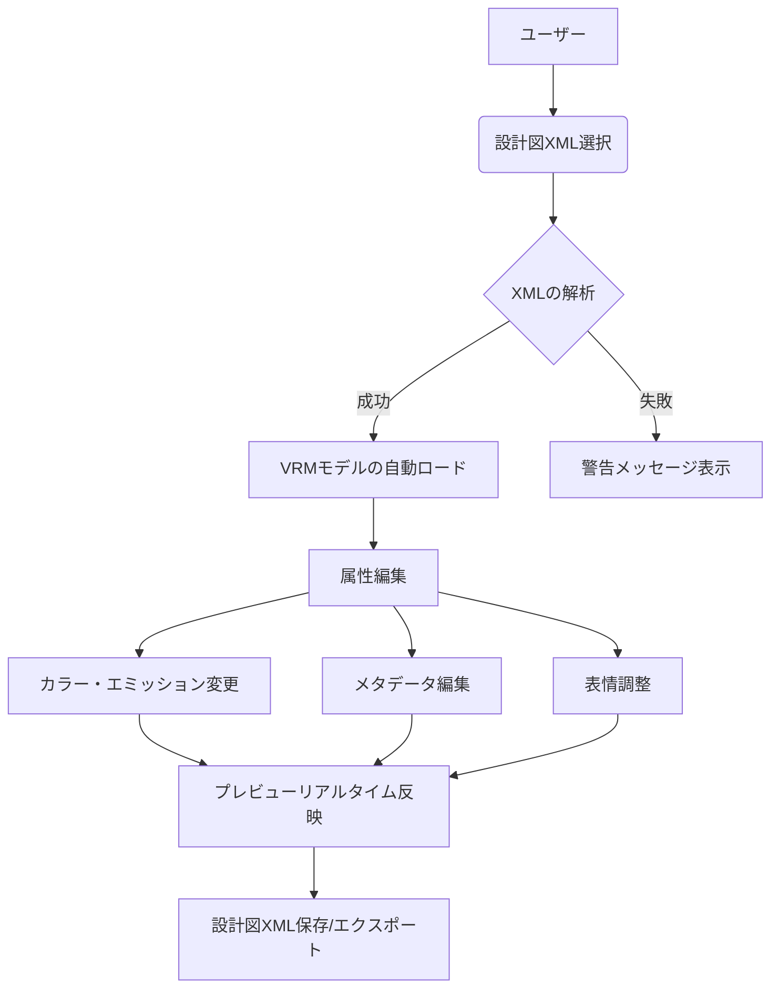

# VRMブループリンター 設計書

## 1. システム概要

### システムの目的と概要
VRMブループリンターは、3Dアバター規格であるVRMモデルのメタデータ編集、および外観設定（カラー、アイコン、表情など）を「設計図」として管理するためのデスクトップアプリケーションです。
あらかじめ定義されたXML形式の設計図ファイルをベースに、VRMモデルの属性を動的に変更し、独自のカスタマイズを施したモデルの書き出しやプレビューを支援することを目的としています。

### 主な機能一覧
| 機能カテゴリ | 概要 |
| :--- | :--- |
| **モデル管理** | VRMファイルの読み込み、3Dプレビュー、メタデータ（タイトル、作者、ライセンス等）の編集 |
| **設計図管理** | 設定情報のXMLインポート・エクスポート、編集内容の永続化 |
| **外観編集** | マテリアルカラー調整、エミッション（発光）設定、テクスチャ動的生成 |
| **アイコン設定** | モデルに関連付けるアイコン画像の選択、表示位置（スクロール）調整 |
| **表情編集** | BlendShape（ブレンドシェイプ）のプリセットおよびカスタムウェイト調整 |
| **システム管理** | 警告・通知メッセージ表示、カメラ制御、UIコントロールの動的生成 |

---

## 2. アーキテクチャ設計

### 使用技術
- **開発基盤**: Unity
- **プログラミング言語**: C#
- **UIフレームワーク**: UI Toolkit (UIDocument)
- **3D規格**: VRM (UniVRMライブラリ)
- **データ永続化**: XMLファイル

### コンポーネント構成
本システムは抽象化されたMVC（Model-View-Controller）パターンを採用しています。

- **アプリケーション層 (Controller/View Logic)**:
  - ユーザー入力を受け取り、ビジネスロジックへの橋渡しとUI更新を行う。
  - `modelColorEdit`, `modelBlendShapeEdit` などのモジュール単位で機能を分離。
- **サービス層 (Service Logic)**:
  - VRMモデルのロード、XMLの解析・生成、テクスチャの動的計算などの純粋なロジックを担当。
- **データ層 (Model/Information)**:
  - システム内で保持するデータ構造（`modelInfo`, `resultInfo`等）とXMLスキーマの定義。

---

## 3. データベース設計

本システムでは従来のRDBMSの代わりに、XMLファイルをデータストアとして使用します。

### ER図（データ構造概念図）

### テーブル定義（データ構造）
#### modelInfo (設計図基本情報)
| フィールド名 | 型 | 制約 | 説明 |
| :--- | :--- | :--- | :--- |
| Name | String | 必須 | 設計図の名称 |
| VrmDirectory | String | 必須 | 参照先VRMファイルのパス |
| modelInfoColor | List | 任意 | カラー設定リスト |
| modelInfoVRMInfo | Object | 必須 | VRM標準メタデータ |

#### modelInfoColor (カラー設定)
| フィールド名 | 型 | 説明 |
| :--- | :--- | :--- |
| Color | String (Hex) | 16進数カラーコード（例: #FFFFFF） |
| Emission | Boolean | エミッション（発光）の有効フラグ |

---

## 4. 機能設計

### 内部API仕様
各機能はモジュール化されたクラスを通じて提供されます。

#### 設計図読込
- **エンドポイント**: `common.ModelXmlLoad`
- **メソッド**: Static Call
- **入力**: `XMLDirectory` (string)
- **出力**: `resultInfo` (処理結果コードおよびメッセージ), `modelInfo` (参照引数)

#### モデル反映
- **エンドポイント**: `vVrmLoader.vrmLoadStatus`
- **入力**: `modelInfo`, `GameObject (vrmObject)`
- **処理**: メモリ上の設定値をUnityのGameObject/VRMMetaコンポーネントへ一括適用。

### バリデーションとエラー処理方針
- **XMLバリデーション**: `XmlTagNotFoundException` を定義し、必須タグの欠落や型不正を厳密にチェック。
- **ファイルエラー**: `FileNotFoundException` をキャッチし、ユーザーに分かりやすいメッセージを通知。
- **例外伝播**: すべての主要処理は `resultInfo` 型を返し、上位層でエラー時のUI表示（`easyAlertMessageShow`）を統合管理。

---

## 5. 業務フロー

1. **モデル選択**: ユーザーが設計図（XML）を指定し、関連付けられたVRMモデルがシーン上に配置される。
2. **モデル編集**: UIを通じてカラーや表情などのパラメータを調整。裏側では動的にテクスチャが生成し直される。
3. **モデル出力**: 編集後の状態をVRMファイルとして書き出し、または設定をXMLとして保存する。

---

## 6. 非機能要件

### セキュリティ
- **ローカル完結型**: データはローカル環境で処理され、外部サーバーへの自動送信は行わない（プライバシー保護）。
- **パス正規化**: 不正なファイルパス参照を防止するための正規化処理の実装。

### パフォーマンス
- **動的テクスチャ生成**: CPU側でのピクセル操作を最小限にし、生成したテクスチャは適切にキャッシュ・破棄してメモリリークを防止。
- **UIレスポンス**: 編集内容の反映をバッチ処理化し、毎フレームの過度な更新を避ける。

### 運用保守
- **モジュール指向**: `ModelColorEdit` や `ModelIconEdit` など、機能ごとに独立したクラス設計にすることで、将来的なプラグイン（Mod）への拡張性を確保。
- **共通基盤**: `common.cs` にユーティリティを集約し、コードの重複を排除。
